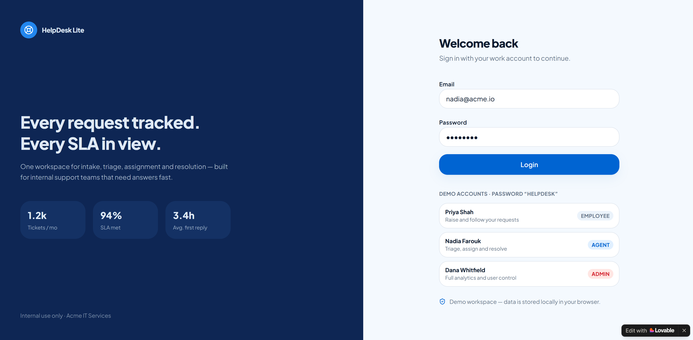
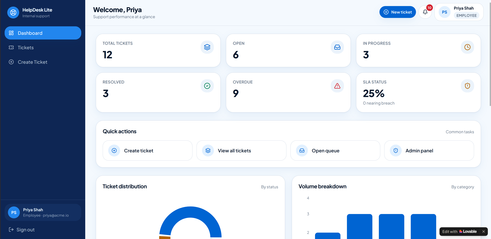
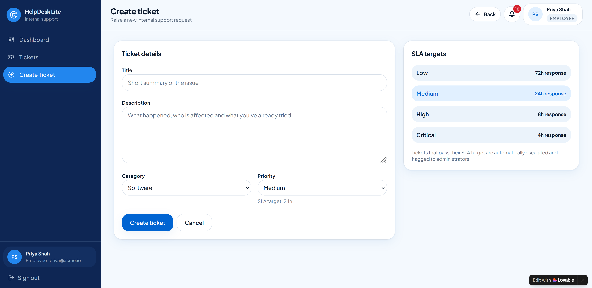
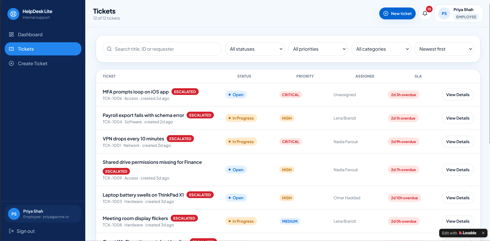

# HelpDesk Lite

HelpDesk Lite is an internal support ticketing workspace designed to improve how employees submit, track, and resolve internal support requests.

This repository documents the complete engineering process behind the project, from requirements gathering to project planning, AI-assisted workflows, collaboration practices, stakeholder communication, and final project presentation.

## Live Demo
=
       🌐 https://helpdesklit.lovable.app/
=


> **Note:** The current live demo is a front-end prototype built with Lovable to demonstrate the user interface and user experience. The application is planned to be connected to a real backend in future iterations.

---

## Web Demo

The HelpDesk Lite web demo provides an interface for managing internal support tickets.

### Dashboard



### Tickets



### Ticket Details




---

## Project Documentation

### Requirements

- Requirement Framing
- Planning-Ready Breakdown
- Initial Execution Plan

### Project Management

- Jira Planning
- Delivery Structure
- Sprint Planning
- Workflow Design

### AI Workflow

- AI Task Mapping
- Context and Access Plan
- AI Coding Workflow
- Debugging and Verification
- Staying Current Plan

### Engineering Collaboration

- Repo-Ready Change Brief
- Branch Strategy
- Commit Sequence
- Pull Request Draft
- Code Review Response Plan
- Merge and Release Checklist

### Project Demo

- Project Demo Structure
- Project Packaging
- Demo Script
- Iteration Improvement
- Final Deliverable

---

## Repository Structure

```text
HelpDesk_Lite/
│
├── assets/
│   ├── demo/
│   └── jira/
│
├── docs/
│   ├── requirements/
│   ├── project-management/
│   ├── ai-workflow/
│   ├── collaboration/
│   └── project-demo/
│
└── README.md
